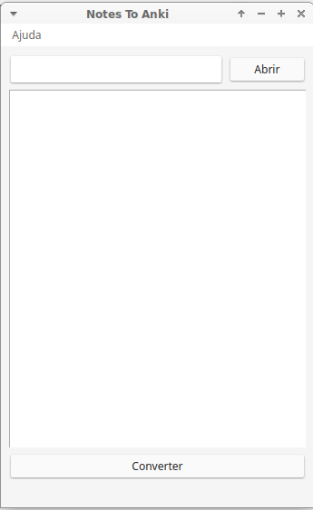
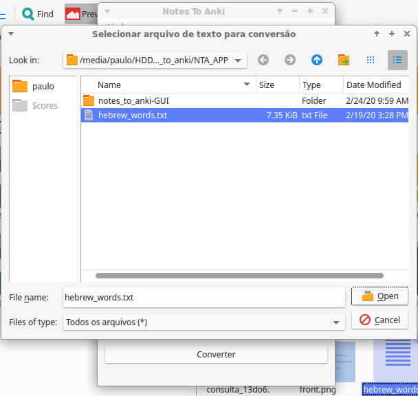
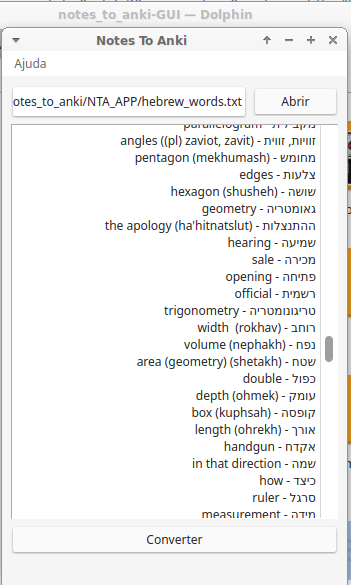
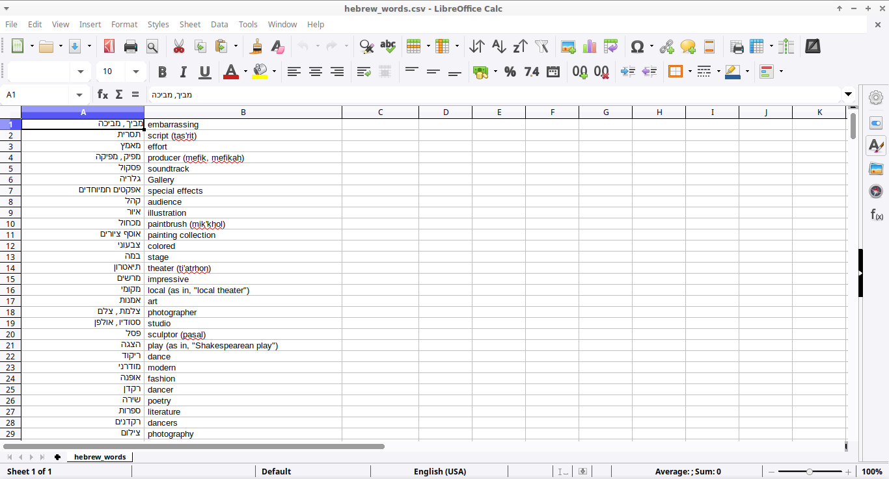
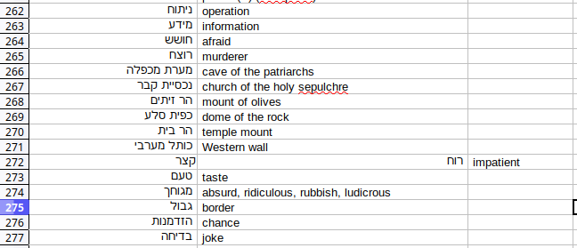

# Introdução

Notes_to_Anki-GUI é a versão com interface gráfica de [um _script_ bem simples](https://github.com/tr4zodone/useful-scripts) que criei um tempo atrás para converter minhas anotações em hebraico para .csv para que eu as pudesse usar no Anki. 

Apesar de eu usá-lo para me ajudar a aprender hebraico, o programa funciona para qualquer língua.

Por quê que eu escrevi este programa? Porque o modo como eu estudo línguas funciona muito bem para mim, e eu acredito que esse programa, por mais simples que seja, possa facilitar o processo de aprendizado de línguas para aqueles que querem usar o Anki para estudar.

## Instalação

**No Windows, basta baixar [este arquivo](http://www.mediafire.com/file/sd7u3t2ue2bn6f4/n_anki.exe/file) e executá-lo**. Uma tela preta abrirá e logo após aparecerá a interface do programa.

Em qualquer outro sistema operacional, basta ter o Python 3 e o PyQt5 instalados, e então executar:

>git clone https://github.com/tr4zodone/notes_to_anki-GUI
>cd notes_to_anki-GUI
>python app.py

## Como funciona

Para criar cartas novas no Anki, deve-se criar uma a uma. Se você quiser juntar várias cartas e então adicionar todas elas de uma vez só, que é o que eu costumo fazer, esse processo rapidamente se tornaria insuportável, ainda mais quando se deseja adicionar centenas de cartas de uma só vez.

Podemos, então, importar cartas no Anki através de arquivos .csv. Uma forma de eliminar o problema seria escrever tudo direto num documento .csv. Para isso, idealmente seria usado um gerenciador de planilhas como o Excel. Isso é fazível, mas, ao meu ver, não é muito prático, ainda mais para fazer edições rápidas e curtas no celular, que é o que eu costumo fazer.

---

Ao abrir o programa, é isso que se vê:

Uma tela simples, com somente três itens: um campo para selecionar arquivos, um botão em que está escrito "converter", e um ecrã branco.

Nós selecionamos o arquivo:

E ele então será aberto e exibido no ecrã:

Lembrando que o programa funciona independentemente da língua-alvo. As anotações em cima estão em hebraico pois é a língua que estou estudando no momento da escrita deste arquivo.

Como você pode ver, as palavras e frases dispostas no arquivo selecionado *devem* estar organizadas da seguinte forma:

>man - homem
>child - criança
>nutcracker - quebra nozes
>indefinitely - indefinidamente

Basta, então, clicar em "Converter" que, no mesmo diretório em que está o arquivo que foi selecionado aparecerá um arquivo .csv.

Basta abrí-lo com um gerenciador de planilhas para checar:

E, como se pode ver, está tudo como desejado.

## Problemas

Como disse acima, as palavras no arquivo devem estar dipostas dessa forma:

>man - homem
>child - criança
>nutcracker - quebra nozes
>indefinitely - indefinidamente
>corkscrew - saca rolhas

Perceba que "quebra-nozes" e "saca-rolhas" estão sem o hífen ("quebra nozes", "saca rolhas"). O motivo disso é que o programa separa as palavras e frases por um traço ("-"). Palavras separadas por traço serão separadas entre si.

Se essa sequência estivesse disposta desta forma:

>...
>nutcracker - quebra-nozes
...
>corkscrew - saca-rolhas

Isso resultaria em duas cartas diferentes no Anki para cada sequência: uma com a parte da frente como "nutcracker" e a parte de trás como "quebra", e uma cuja parte da frente seria "nozes" e não teria parte de trás. O mesmo se repetiria para _corkscrew_ e suas palavras relacionadas.

Um exemplo disso em minhas próprias anotações foi com a expressão קצר-רוח (katser-ruakh), que significa "impaciente". No arquivo .csv esse problema é demonstrado da seguinte forma:

Como se pode perceber, _impatient_ está fora da coluna correta.

Isso pode facilmente ser consertado fazendo uma breve edição no arquivo e colocando as palavras em seus devidos lugares. Todavia, achei que seria importante dizer como poderíamos evitar esse pequeno inconveniente.

## TO-DO:

Coisas que ainda merecem ser implementadas. Não tenho, entretanto, data marcada para implementar essas mudanças:

- _Possibilitar_ a seleção de diferentes tipos de separadores, como "=" ou ":" no lugar de "-".
- Integrar este programa ao Anki na forma de complemento (addon) e, se possível, fazer com que a conversão do arquivo seja direta para o formato de baralho, em vez de para .csv para então precisar ser importado.